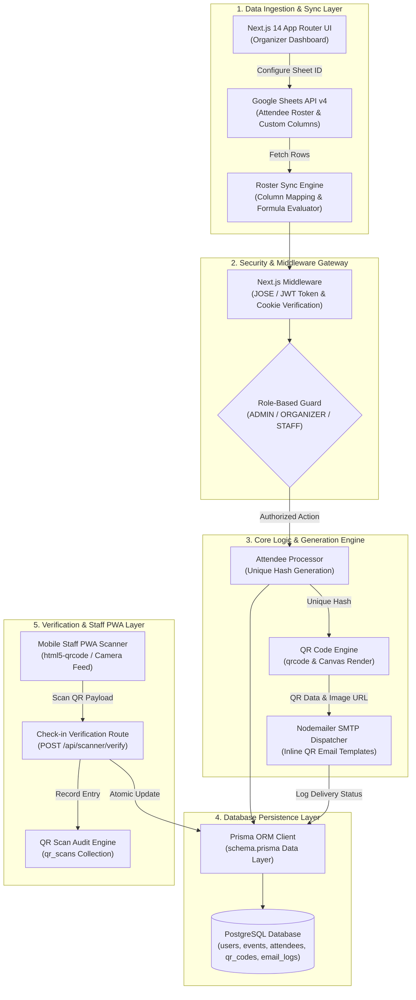

<div align="center">
  
</div>

<h1 align="center">EVENTAR🎟️</h1>

<div align="center">

[](https://nextjs.org/)
[](https://www.typescriptlang.org/)
[](https://www.prisma.io/)
[](https://www.postgresql.org/)
[](https://tailwindcss.com/)
[](https://web.dev/progressive-web-apps/)
[](LICENSE)

</div>

<br />

> **Eventar is an enterprise-grade event management, real-time ticket generation, and automated check-in platform that seamlessly synchronizes attendee rosters from Google Sheets, generates cryptographically signed QR tickets, and enables instant mobile staff verification.**
> 
> **Note:** The source code for this application is hosted in a private repository to protect proprietary security algorithms and system configurations. This public repository serves as an architectural overview and technical demonstration of the platform.
---

## Table of Contents

- [Overview & Key Features](#overview--key-features)
- [System Architecture & Data Flow](#system-architecture--data-flow)
- [Technical Deep Dive](#technical-deep-dive)
- [Quick Start Guide](#quick-start-guide)
- [Configuration Reference](#configuration-reference)
- [Troubleshooting & Diagnostics](#troubleshooting--diagnostics)

---

## Overview & Key Features

**Eventar** solves the operational friction of large-scale event organization by automating the entire lifecycle from attendee registration to physical door entry. Organizers connect their existing Google Sheets data source, auto-generate unique digital QR tickets, dispatch customized HTML emails, and equip door staff with a high-performance PWA scanner app for zero-latency check-in verification.

- **Automated Google Sheets Sync Engine**: Seamlessly pulls attendee data from Google Sheets, maps custom database columns, and dynamically evaluates email formula templates.
- **Cryptographic QR Ticket Generation**: Produces unique SHA-256 hashed QR codes for every attendee, preventing ticket forgery and double-entry fraud.
- **High-Speed Mobile PWA Scanner**: Progressive Web App camera scanner (`html5-qrcode`) enabling event staff to verify tickets instantly on any mobile device.
- **Granular Multi-Role Authorization**: Strict role hierarchy (`ADMIN`, `ORGANIZER`, `STAFF`) with configurable event creation quotas and event-specific staff assignment controls.
- **Transactional SMTP Dispatch & Audit Log**: Custom SMTP configuration engine with real-time delivery status tracking, retry logs, and error auditing.

---

## System Architecture & Data Flow

The following sequence details how event data flows from Google Sheets integration, through Prisma database persistence, ticket generation, email delivery, and mobile PWA scanner verification.



---

## Technical Deep Dive

### 1. Cryptographic Hash & Unique Attendee Resolution (`prisma/schema.prisma` & `lib/`)
To eliminate duplicate entry vectors and ticket spoofing, Eventar computes a deterministic `uniqueHash` string for each attendee based on the event ID, attendee email, and unique registration identifier.

```typescript
import crypto from 'crypto';

export function generateAttendeeHash(eventId: string, email: string, uniqueId: string): string {
  const payload = `${eventId}:${email.toLowerCase().trim()}:${uniqueId.trim()}`;
  return crypto.createHash('sha256').update(payload).digest('hex');
}
```

### 2. Edge Middleware JWT & Role Protection (`middleware.ts`)
Eventar enforces lightweight, zero-latency route authorization at the edge using the `jose` JWT verification library. Requests targeting protected administrative or scanning routes pass through role validation checks prior to hitting backend API handlers.

```typescript
import { NextResponse } from 'next/server';
import type { NextRequest } from 'next/server';
import { jwtVerify } from 'jose';

export async function middleware(req: NextRequest) {
  const token = req.cookies.get('token')?.value;
  if (!token) return NextResponse.redirect(new URL('/login', req.url));

  try {
    const secret = new TextEncoder().encode(process.env.JWT_SECRET);
    const { payload } = await jwtVerify(token, secret);
    req.headers.set('x-user-role', payload.role as string);
    return NextResponse.next();
  } catch (err) {
    return NextResponse.redirect(new URL('/login', req.url));
  }
}
```

### 3. Dynamic Google Sheets Column Mapper (`googleapis` Integration)
Organizers link their external Google Sheets directly to Eventar. The sync engine parses raw header rows dynamically, maps fields (such as `Name`, `Email`, `Phone`, `Department`), and converts formula strings into custom email payloads.

```typescript
import { google } from 'googleapis';

export async function fetchSheetData(spreadsheetId: string, range: string, auth: any) {
  const sheets = google.sheets({ version: 'v4', auth });
  const response = await sheets.spreadsheets.values.get({
    spreadsheetId,
    range,
  });
  return response.data.values || [];
}
```

### 4. Dynamic System SMTP Engine & Dispatch Logger (`lib/email.ts`)
Rather than relying on static environment variables, Eventar supports dynamic SMTP host configurations stored directly in the `SystemConfig` table. Emails are dispatched with embedded QR code CID attachments and logged in `EmailLog` for failure auditing.

```typescript
import nodemailer from 'nodemailer';

export async function sendTicketEmail(smtpConfig: any, recipient: string, subject: string, htmlContent: string, qrBuffer: Buffer) {
  const transporter = nodemailer.createTransport({
    host: smtpConfig.smtpHost,
    port: smtpConfig.smtpPort,
    auth: { user: smtpConfig.smtpUser, pass: smtpConfig.smtpPass },
  });

  return await transporter.sendMail({
    from: `"${smtpConfig.senderName}" <${smtpConfig.senderEmail}>`,
    to: recipient,
    subject,
    html: htmlContent,
    attachments: [{ filename: 'ticket-qr.png', content: qrBuffer, cid: 'qrcode@eventar' }],
  });
}
```

### 5. Mobile Camera PWA Verification Scanner (`components/scanner/`)
The staff scanning portal is built using `html5-qrcode` wrapped inside a client component. It operates smoothly on mobile web browsers, accessing device cameras to decode QR payloads and emit validation requests to `/api/scanner/verify`.

---
